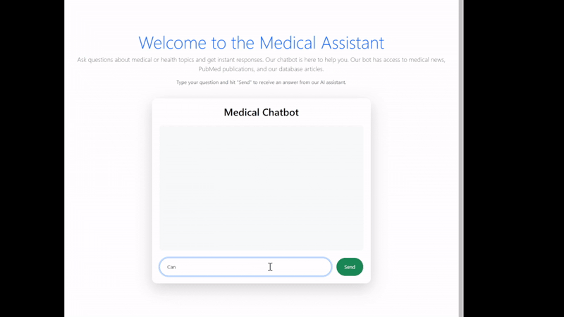

# Medical Chatbot with RAG and PubMed Integration




## Overview
This project is a **Medical Chatbot** designed to provide accurate and relevant information on health and medical topics. It leverages **Retrieval-Augmented Generation (RAG)** to retrieve information from various sources, including **PubMed articles**, medical news websites, and a specified database of documents (e.g., PDFs). The chatbot is built using a combination of modern AI technologies and web development frameworks, making it a powerful tool for answering medical-related queries.

## Key Functionalities

### Health and Medical News:
The chatbot can retrieve and answer questions based on the latest health and medical news from trusted sources such as:
- **Medical News Today**
- **World Health Organization (WHO)**
- **Centers for Disease Control and Prevention (CDC)**
- **News-Medical.net**
- **Medscape**
- **PubMed Trending Articles**
- **The Lancet**

### PubMed Research and Articles:
The chatbot can fetch and provide information from **PubMed**, a vast database of medical research articles. It retrieves abstracts, titles, and other relevant details from PubMed articles to answer user queries.

### Specified Database Querying:
The chatbot can answer questions based on a specified database (e.g., a collection of PDFs or other documents). Users can query the database for specific information, and the chatbot will retrieve and summarize the relevant content.

### Interactive Chat Interface:
The chatbot provides an interactive chat interface where users can type their questions and receive responses in real-time. The bot's responses are typed out word by word to simulate a natural conversation.

### Contextual Awareness:
The chatbot maintains a chat history, allowing it to contextualize follow-up questions based on previous interactions.

## Tech Stack

### Backend
- **Python**: The core logic of the chatbot is written in Python.
- **FastAPI**: A modern, fast (high-performance) web framework for building APIs with Python.
- **LangChain**: A framework for developing applications powered by language models. It is used for creating the RAG agent, managing tools, and handling the chat history.
- **Google Generative AI**: The chatbot uses Google's Generative AI models (Gemini) for embeddings and language model tasks.
- **FAISS**: A library for efficient similarity search and clustering of dense vectors. It is used to store and retrieve document embeddings.
- **PubMed API**: The chatbot integrates with PubMed's API to fetch medical research articles and abstracts.

### Frontend
- **React**: A JavaScript library for building user interfaces. The chatbot's frontend is built using React.
- **Axios**: A promise-based HTTP client for making API requests to the backend.
- **Bootstrap**: A CSS framework used for styling the chatbot interface.

### Other Tools
- **dotenv**: Used for managing environment variables.
- **PyMuPDF (fitz)**: A Python library for reading and extracting text from PDF documents.
- **uvicorn**: An ASGI server for running the FastAPI application.
- **Github actions**: A CI/CD tool for testing and docker build and push
## How It Works

1. **User Query**: The user types a question into the chat interface.
2. **Backend Processing**:
   - The query is sent to the backend, where an AI agent with multiple RAG agents as its tools processes it.
   - The agent uses the appropriate RAG tool (news, PubMed, or the specified database) to retrieve relevant information.
   - The retrieved information is passed to the language model (Google Generative AI) to generate a response.
3. **Response Generation**: The response is sent back to the frontend, where it is displayed to the user in a conversational format.

## Setup and Installation

### Prerequisites
- Python 3.8 or higher
- Node.js (for frontend)
- Google API Key (for Google Generative AI)

### Backend Setup
1. Clone the repository:
    ```bash
    git clone <repository-url>
    cd <repository-folder>
    ```
2. Install Python dependencies:
    ```bash
    pip install -r requirements.txt
    ```
3. Set up environment variables:
    - Create a `.env` file in the root directory and add your Google API key:
    ```plaintext
    GOOGLE_API_KEY=your_google_api_key
    ```
4. Run the FastAPI server:
    ```bash
    uvicorn main:app --reload
    ```

### Frontend Setup
1. Navigate to the frontend directory:
    ```bash
    cd frontend
    ```
2. Install Node.js dependencies:
    ```bash
    npm install
    ```
3. Start the React development server:
    ```bash
    npm start
    ```

## Running the Application
- The backend will be running on `http://127.0.0.1:8000`.
- The frontend will be running on `http://localhost:3000`.
- Open the frontend in your browser to start interacting with the chatbot.

## Running with Docker

### Building and Running Docker Containers
You can use the provided Docker images to run both the frontend and backend.

#### Pull Prebuilt Images (Recommended)
```bash
# Pull frontend image
docker pull medical-assistant-app-frontend

# Pull backend image
docker pull medical-assistant-app-backend
```

#### Build Docker Images Manually
```bash
# Build backend image
cd backend
docker build -t medical-assistant-app-backend .

# Build frontend image
cd ../frontend
docker build -t medical-assistant-app-frontend .
```

#### Run Containers
```bash
# Run backend container
docker run -d -p 8000:8000 --name chatbot-backend medical-assistant-app-backend

# Run frontend container
docker run -d -p 3000:3000 --name chatbot-frontend medical-assistant-app-frontend
```

## CI/CD: Docker Build and Push
To automate the Docker image build and push process, a CI/CD pipeline is set up with Github actions.


## Contributing
Contributions are welcome! Please feel free to submit issues or pull requests to improve the project.

## License
This project is licensed under the **MIT License**. See the LICENSE file for details.

